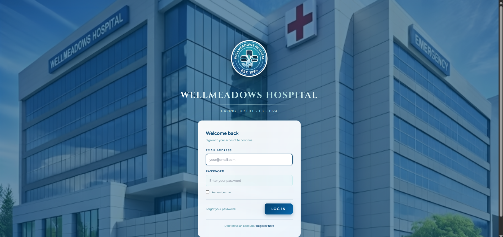
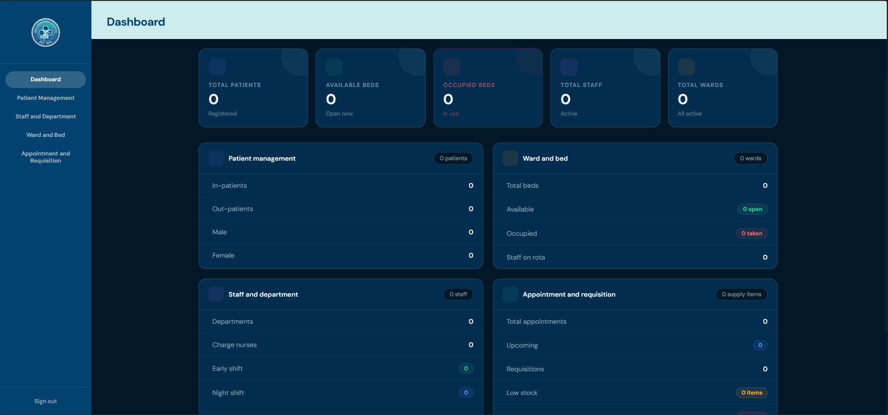
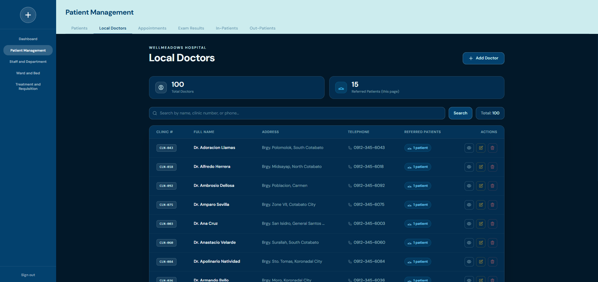
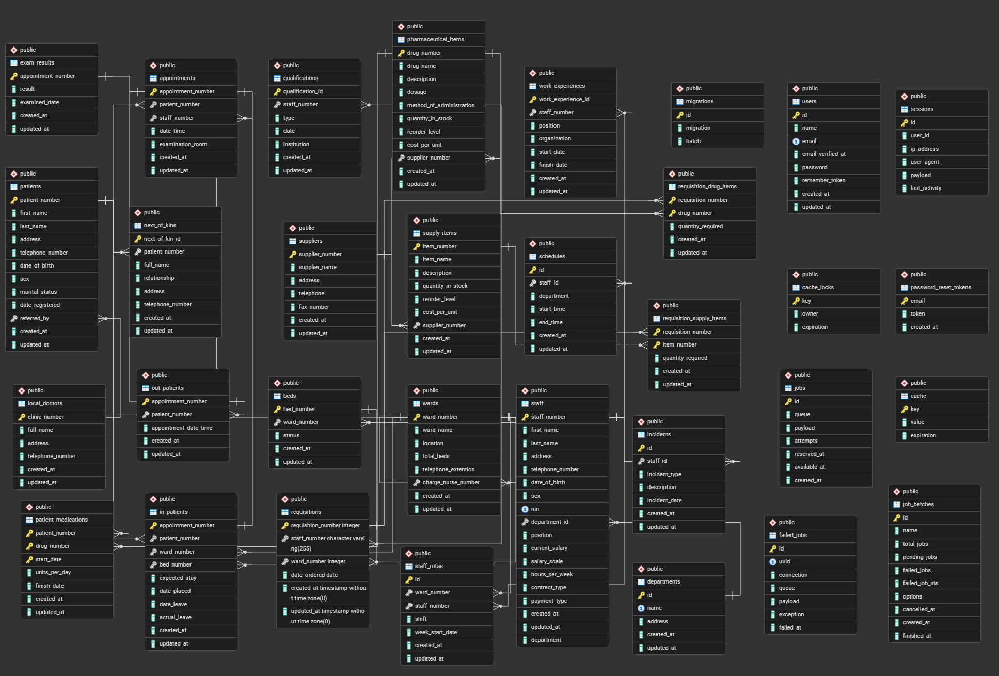

# Project Name: Wellmeadows Hospital Management System

## Project Description

A web-based hospital management system built for Wellmeadows Hospital. The system handles patient registration and management, appointment scheduling, examination results, in-patient admissions, out-patient records, pharmaceutical and surgical supply inventory, staff-driven requisitions, and patient medication tracking. It is organized into four modules — Patient Management, Appointment and Treatment, Staff and Department, and Ward and Bed — each developed by a dedicated team member.

## Team Members

| Name | Module |
|Isaiah Gabrille Bugtong|Patient Management|
|Kurt John Baterbonia|Staff Management|
|Scott Nels Quinaud|Ward & bed Management|
|Francis Cesar Apal|Appointment & Treatment|

---

## Tech Stack

- Laravel
- PHP
- PostgreSQL
- Railway
- Bootstrap/Tailwind

---

## Repository Link

https://github.com/Francheeze/Wellmeadows.git

---

## Setup Instructions

```bash
git clone <repo>

composer install
npm install

cp .env.example .env

php artisan key:generate
```

---

## Environment Variables

Update `.env`

```env
APP_NAME="Wellmeadows Hospital"
APP_ENV=local
APP_KEY=
APP_DEBUG=true
APP_URL=http://localhost
APP_TIMEZONE=Asia/Manila

DB_CONNECTION=pgsql
DB_HOST=127.0.0.1
DB_PORT=5432
DB_DATABASE=Wellmeadows
DB_USERNAME=
DB_PASSWORD=
```

---

## Run Migration

```bash
php artisan migrate
```

---

## Start Development Server

```bash
npm run dev
php artisan serve
```

---

## Default Login

Admin Account

```txt
email:theboys@email.com
password:12345678

we actually dont have RBAC implemented yet
```

---

## Database Information

### Database Platform

Railway PostgreSQL

### Main Tables

| Table | Purpose |
|---|---|
| users | authentication |
| suppliers | supplier directory |
| supply_items | surgical/non-surgical items inventory |
| pharmaceutical_items | drug inventory |
| patient_medications| patient drug prescriptions |
| requisitions | supply/drug requisition orders |
| requisition_supply_items| pivot — requisition ↔ supply items |
| requisition_pharmaceutical_items| pivot — requisition ↔ pharmaceutical items |
| local_doctors | may refer patient |
| patients | patient registry |
| next_of_kins | patient next of kin records |
| appointments | appointment scheduling |
| exam_results | post-appointment examination outcomes |
| in_patients | in-patient admission records |
| out_patients | out-patient classification records |
| staff | staff registry |
| departments | department registry |
| wards | ward registry |
| beds | bed registry |
| work_experiences | staff work history |
| staff_rotas | staff-- ward allocation |
| schedules | staff time-in/time-out |
| qualifications | staff qualifications |


---

## Module Assignment

| Module | Assigned Developer |
|---|---|
| Patient Management | Isaiah Gabrille Bugtong |
| Appointment & Treatment | Kurt John Baterbonia |
| Staff & Department | Scott Nels Quinaud |
| Ward & Bed | Francis Cesar Apal |

---

## Deployment Information

### Live URL

```txt
https://wellmeadows-production.up.railway.app
```

### Hosting Platform

```txt
Railway
```

---

## Screenshots

### 1. Login Page

Login interface for the Wellmeadows Hospital Management System, allowing users to enter their credentials and access the dashboard.

### 2. Dashboard

Main dashboard interface for the Wellmeadows Hospital Management System.

### 3. CRUD Module Example (Patient Management)
  CRUD interface for managing local doctors in the Patient Management module, showing CRUD operation buttons.

### 4. PostgreSQL Database Tables

PostgreSQL database schema showing all hospital system tables in pgAdmin.